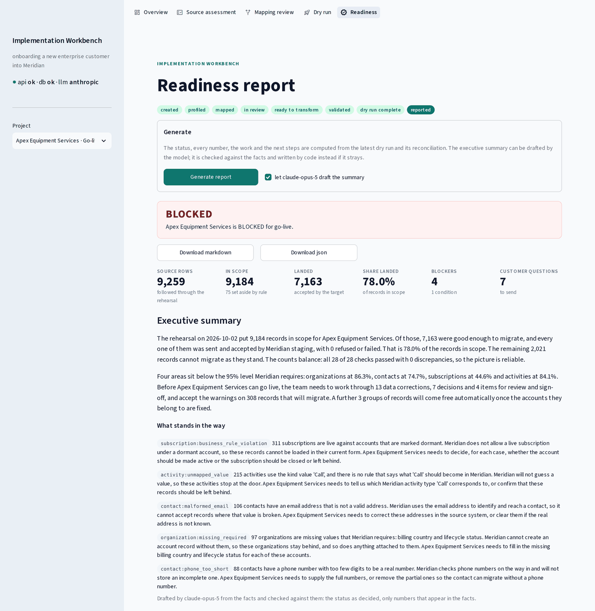
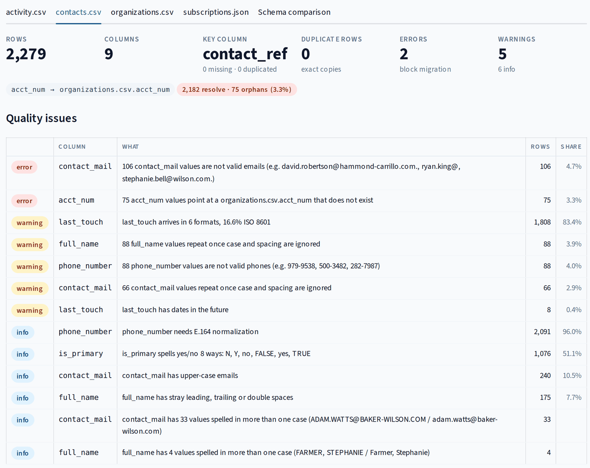
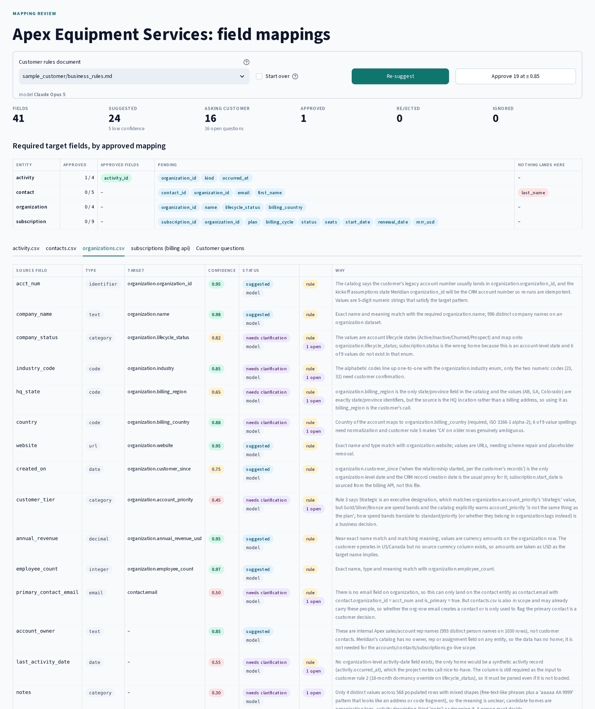
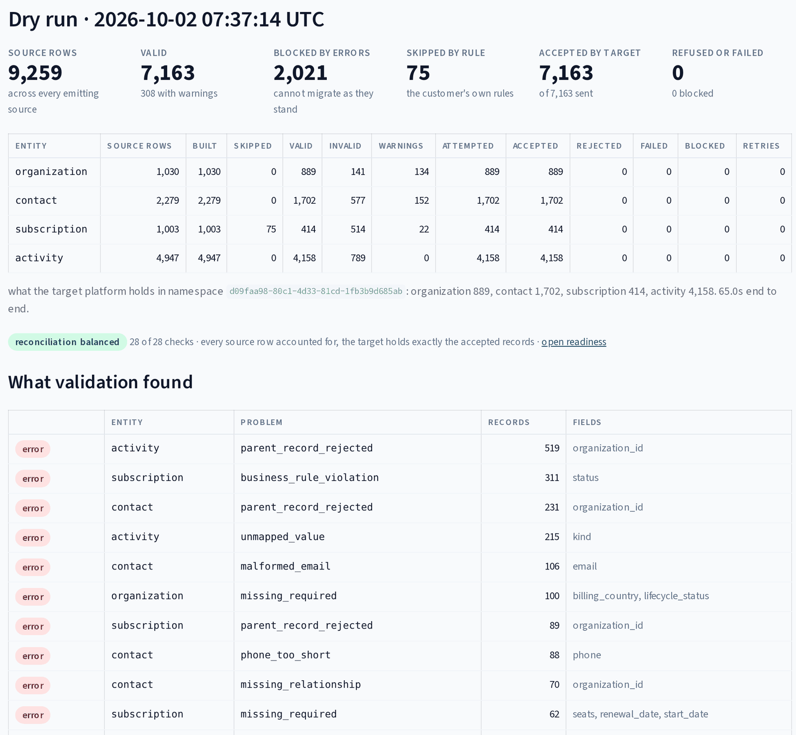

# AI-Assisted Enterprise Implementation & Data Onboarding System

A customer implementation system for mapping, validating, and migrating enterprise data into a SaaS platform: source profiling, deterministic schema comparison, AI-assisted semantic mapping with human review, deterministic transformation and validation, dry-run migration through the target API, reconciliation, and an implementation readiness report.

The scenario: a B2B SaaS company signed a new enterprise customer. That customer's data lives in a legacy CRM export, a billing system behind a REST API, and a business-rules document nobody has read in a year. Before go-live, all of it has to land in the platform's schema, and somebody has to answer *can this customer safely migrate, what has to change first, and what still needs the customer's input?*

This tool is what an implementation or forward-deployed engineer would use to answer that.

> The customer (Apex Equipment Services), the target platform (Meridian), and every record are fictional and synthetic. This is a portfolio build, not a client engagement. Any business impact figure in the docs is labeled as a scenario estimate.



**In one paragraph:** the system takes a new customer's messy exports, measures what is wrong with them, has an AI model propose where every field belongs while a person approves each decision, rehearses the whole migration against the target platform's API in a sandbox, proves that no record went missing on the way, and tells the customer in plain language what stands between them and go-live. The AI handles meaning; everything that has to be exactly right (counting, validation, the go/no-go decision) is ordinary code with tests.

## Contents

- [Why this problem matters](#why-this-problem-matters)
- [Who this is for](#who-this-is-for)
- [What the system does](#what-the-system-does)
- [What it looks like](#what-it-looks-like)
- [The one rule: where AI is and is not allowed](#the-one-rule-where-ai-is-and-is-not-allowed)
- [End-to-end workflow](#end-to-end-workflow)
- [Architecture](#architecture)
- [Engineering considerations](#engineering-considerations)
- [Evaluation and testing](#evaluation-and-testing)
- [Tech stack](#tech-stack)
- [Quick start](#quick-start)
- [Project layout](#project-layout)
- [Deployment](#deployment)
- [Current limitations](#current-limitations)
- [Future work](#future-work)
- [Documentation](#documentation)

## Why this problem matters

Enterprise onboarding looks simple from the outside: receive the customer's data, map it into the new platform, import it, go live. The risky part is everything between "receive the data" and "go live."

Customer data arrives in different formats, uses different names for the same concept, contains duplicate and malformed records, omits required fields, and conflicts with the target system's rules. A migration can report success and still load wrong data that surfaces weeks later as billing errors, broken account relationships, and support tickets.

Common failure modes this system is built to catch before go-live:

- duplicate organizations and contacts under different identifiers
- required fields that are blank or hold placeholders (`n/a`, `unknown`)
- dates in six formats, numbers stored as text with currency symbols, booleans spelled five ways
- source fields that do not match any target field by name
- fields that match a target by name but mean something else (`status` on which record?)
- child records that point at parent records that do not exist
- imports that "succeed" while source and destination counts do not reconcile

A schema mismatch found during profiling takes minutes to fix. The same mismatch found after production migration pulls in Support, Engineering, Implementation, and the customer to work out what changed, which records were affected, and whether the migrated data can still be trusted.

> Find uncertainty and bad data before go-live, make the migration explainable, and keep an audit trail of what happened and why.

## Who this is for

The workflow is modeled around the people involved in a real enterprise implementation:

- **Implementation Engineers / Forward Deployed Engineers** configure the migration, investigate edge cases, and own technical delivery.
- **Customer Engineers / Solutions Engineers** turn customer requirements into a working implementation.
- **Customer technical stakeholders** supply the source data, explain customer-specific fields, and resolve ambiguous mappings.
- **Support Engineers** deal with the fallout when incorrect or incomplete data reaches production.
- **End users** depend on migrated records being right so their accounts and subscriptions behave.

Onboarding is treated as a cross-functional system, not a one-time import script.

## What the system does

The system turns raw customer data into a migration decision:

```text
customer sources (csv, json, legacy billing api)
        |
        v
  source profiler ------------------------------> pandas, deterministic
        |
        v
  schema comparison ----------------------------> deterministic classification
        |
        v
  ai mapping service ---------------------------> provider interface (anthropic | openai | none)
        |                                         structured output validated by pydantic
        v
  human review + customer clarification --------> stored decisions, nothing auto-approved below threshold
        |
        v
  transformation engine ------------------------> explicit rules, no generated code executed
        |
        v
  validation engine ----------------------------> target pydantic models + enums + fk + business rules
        |
        v
  migration runner (dry run) -------------------> httpx against the target api, retries, failure capture
        |
        v
  target platform api + postgres "target" schema
        |
        v
  reconciliation -------------------------------> source vs transformed vs accepted, deterministic
        |
        v
  readiness report -----------------------------> READY / READY WITH CONDITIONS / BLOCKED
```

The result is not "import succeeded." It is evidence that lets an implementation engineer decide whether the customer is `READY`, `READY WITH CONDITIONS`, or `BLOCKED`, and a list of what has to change or be answered before that changes.

Three ways in:

- **Workbench UI** (Streamlit): create a project, attach sources, profile them, read the quality issues and the schema comparison, get a proposed target for every field, decide each one, answer the customer's questions, read the transformation plan, validate, rehearse the migration against the target platform with every refusal explained, reconcile source against target, and read the readiness report with its blockers, customer questions and next steps. Talks to the API over HTTP only.
- **REST API** (FastAPI): every operation the UI performs, plus the simulated billing source and, in the same process, the simulated target platform.
- **CLI** (Typer): `check`, `generate-data`, `profile [--compare]`, `suggest`, `eval-mapping` and `eval-summary` work on one file or feed without the API or the database; `transformation-plan`, `validate`, `dry-run`, `reconcile` and `readiness-report` run the later stages on a project and print the same counts the workbench shows; `migrate` applies the schema migrations.

## What it looks like

**Source assessment.** Before anything moves, every file and feed is measured from its raw values: malformed emails, records pointing at accounts that do not exist, one date column in six formats. Each finding is a count of cells that failed a stated rule, with examples.



**Mapping review.** The model proposes where each of the customer's columns belongs in the target platform, with a confidence and a reason a person can check. Anything ambiguous becomes a question for the customer instead of a guess: `customer_tier` comes back at 0.45 because the customer's own rules say it is neither a plan nor a priority. A person approves every field.



**Dry run.** The migration is rehearsed against the target platform's API inside a sandbox namespace, one request per record, with retries and every refusal recorded. Reconciliation then follows every source row through to the target: 9,259 rows accounted for, 28 of 28 checks passed.



## The one rule: where AI is and is not allowed

Use the model where semantic reasoning adds something. Use deterministic code everywhere deterministic code is more reliable.

**The model is allowed to:** propose which source field means which target field and say why; interpret the customer's business-rules prose; suggest transformations (enum maps, normalizations, composites); write the clarification questions sent to the customer; explain migration blockers in plain language; draft the executive summary of the readiness report from numbers computed elsewhere.

**The model is never allowed to:** count rows, do arithmetic, detect duplicates, validate against the schema, execute generated code, compute reconciliation numbers, decide that an invalid record is valid, write to the target platform, or approve a low-confidence mapping on its own.

Concretely: does `customer_tier` mean `account_priority` or `subscription.plan`? That is a semantic question and the model may propose an answer with a confidence and a reason. Are 10,000 records still 10,000 records after transformation? That is arithmetic and the model is not consulted.

The transformation engine never executes model-generated Python. A model suggestion is a proposal a person reviews, not migration truth.

## End-to-end workflow

Every stage below runs in the codebase, with or without a model key. What each one cannot do yet is listed under [Current limitations](#current-limitations).

### 1. Data ingestion and profiling

**Sources.** A project attaches the customer's sources by location: a csv or json file under one of the configured source roots (`sample_customer/data`, `generated`), or the url of a feed. File paths are checked against the roots before the filesystem is touched; absolute paths and `..` are refused with a 422. The customer's billing system is a paginated REST API with a bearer token (`page`, `page_size`, `has_more`), and the loader pages through it with httpx exactly as it would against the real system. A wrong token is a 401; a feed failure surfaces as a 502 `source_unavailable` and leaves the project's stage alone.

**Raw values, not pandas dtypes.** csv cells stay the strings that were in the file. pandas is told not to guess types, so zip codes never become floats, `unknown` never becomes NaN, and `"60"` and `60` stay distinguishable. json and api records keep their json types, so a column that is an integer in 70% of records and a string in the rest is reported as exactly that.

**Per cell, then per column.** Every non-blank cell gets a tag: integer, decimal, numeric text with symbols, date with the format that parsed it, datetime, email or malformed email, url with or without a scheme, phone or short phone, identifier, code, text. Placeholders (`n/a`, `unknown`, `-`) count as missing and are counted separately. The column's type is the dominant tag with a few rules on top (a digits-only column named like an id is an identifier, not a quantity; `0`/`1` is boolean only when the name says so). Whatever does not fit the type is counted as malformed, with examples.

Per column: null and placeholder counts, distinct count and uniqueness, sample values, value shapes (`AA-999999`), the full value distribution when there are at most 50 distinct values, case variants, stray whitespace, and per-type extras (date formats and ISO share, numeric text and `x.0` counts, boolean spellings, E.164 share, normalized duplicates for emails and names). Per dataset: exact duplicate rows, the key column (a name that says id, ref or num with nearly unique values), missing and duplicated keys.

**Across files.** Any column carrying the same name as another dataset's key column is checked against it: how many values resolve, how many are orphans, with examples. On the sample this finds the 50 injected dangling account numbers in `contacts.csv` and, on top of them, the 25 contacts of the 13 organizations whose own account number is blank. That second group is exactly what an implementation engineer needs to know and what a looser check would hide.

**Issues with severities.** The profile becomes a list a person can act on. **error**: rows will be rejected or cannot be migrated until someone decides (missing or duplicated keys, orphan references, malformed emails or ids). **warning**: a rule or a decision is needed before the dry run (mixed date formats, numeric text, placeholders, high null rates, near-duplicates, inconsistent json types, future dates). **info**: normalization handles it (case variants, whitespace, boolean spellings, urls without a scheme, upper-case emails).

**Measured on the committed sample** (1,030 organizations, 9,259 rows across four sources): profiling runs in about 2 seconds inside the container, billing feed included. The 10,000-organization customer (92,751 rows) takes about 18 seconds.

**Synthetic customer.** A reproducible generator writes the customer's exports with realistic defects and records how many of each it injected in a `manifest.json` next to the data: 45 defect kinds on the committed sample, including duplicate organizations under new and reused ids, missing and dangling account numbers, malformed and upper-case emails, dates in six formats, `CA` meaning both Canada and California, `Legacy Gold` and `Pro` where the target wants `enterprise` and `professional`, seat counts as text, quarterly billing the target does not support, and rule conflicts such as Strategic accounts on Starter plans. The repo ships a 1,000-organization sample (seed 42) so it works out of the box; `make seed` or the CLI generates 10,000 or any size, byte-identical for a given seed.

### 2. Schema comparison

Deterministic, and honest about what it cannot know. It sees three things: the column name, the profiler's stats, and the target catalog.

**Names.** Lower-cased, split on `_` and camelCase, singularized, passed through a small synonym table (`acct` to `account`, `mail` to `email`, `dt` to `date`, `freq` to `cycle`, `st` to `region`). The entity a file is about is read from its name (`organizations.csv`, `subscriptions (billing api)`) and can be overridden per dataset. Inside that entity the entity's own prefix is set aside on both sides, so `sub_status` and `subscription.status` compare as `status` against `status`. The score is a weighted token overlap; generic words (`id`, `name`, `date`, `count`, `last`) weigh half. It is a name similarity, not a confidence, and the workbench labels it that way.

**Five classes.**

| class | meaning |
|---|---|
| `MATCHED` | one candidate in the entity scores at least 0.7 with no close rival, and the values fit as they are |
| `TRANSFORMATION_REQUIRED` | the same match, but the profile says a rule is needed: date formats, currency text, enum values outside the target list, boolean spellings, E.164, urls without a scheme, json type casts, placeholders |
| `AMBIGUOUS` | a candidate scores at least 0.4 in the entity or 0.6 in another entity, or two candidates tie, or the entity is unknown and the name fits two of them; a person confirms |
| `UNMAPPED` | no name token helps; needs semantic mapping |
| `INCOMPATIBLE` | the match is clear but no rule gets there: free text into an integer, 80 distinct values into a four-value enum, an empty column |

**Required-field coverage.** Per target entity: which required fields are covered by a `MATCHED` or `TRANSFORMATION_REQUIRED` source field, which only have an `AMBIGUOUS` candidate, and which have nothing. On the sample this is exactly the mapping stage's to-do list: `organization_id` in every entity (someone has to say that `acct_num` is the account), `contact.first_name` and `last_name` (a split of `full_name`), `subscription.plan` (`subscription_level`) and `subscription.mrr_usd` (`monthly_amount`).

**What it refuses to do.** Guess that `acct_num` is `organization_id`, that `customer_tier` is `account_priority`, or that `created_on` is `customer_since`. Those are semantic calls. By the one rule they belong to the model's proposal and a person's approval, and this deterministic result is the context that proposal is made against. A comparison that already guessed would also poison the mapping eval: it would measure the heuristic, not the model.

**Measured on the sample:** 5 `MATCHED`, 18 `TRANSFORMATION_REQUIRED`, 2 `AMBIGUOUS`, 16 `UNMAPPED`, 0 `INCOMPATIBLE`. The comparison is computed on request from the stored profile and never persisted: it is a pure function of the profile and the catalog, so storing it would only create a stale copy.

### 3. Schema mapping: AI-assisted, human-approved

This is where the model earns its place. It is asked about one dataset at a time and sees, per column: the inferred type, null and unique rates, distinct count, and then only what the column's kind justifies. Small vocabularies (statuses, tiers, plans, roles, countries, booleans) are sent with their counts because those values are the business meaning. Dates get their formats and range, numbers their range and how many carry symbols, identifiers their shapes and three examples. Emails, phones, urls, people's and companies' names and free text get shapes and counts and no values at all. Alongside: the deterministic comparison for the column, the whole target catalog with types, enums, required flags and descriptions, the target's cross-record rules, the dataset's key and orphan facts, and the customer's business-rules document. It never sees a row.

It answers in a closed schema that both providers enforce at decoding time, one entry per source field:

```json
{
  "source_field": "customer_tier",
  "target_field": null,
  "confidence": 0.41,
  "reason": "Gold/Silver/Bronze read as a spend band, but Strategic is an executive designation per rule 3. The target has both account_priority and subscription.plan; the rules doc says it is neither exactly.",
  "transformation_required": true,
  "clarification_required": true
}
```

What the schema cannot enforce is checked before anything is stored: every source field answered exactly once, no invented fields, every target in the catalog, confidence in 0..1, a question whenever one is required, a rule whenever one is required. Problems are sent back to the model verbatim, up to three attempts in total; then the call is recorded as failed and the API answers 502 with the problems listed. Nothing is written from a rejected answer.

The provider sits behind one interface. Anthropic is the default, OpenAI runs behind the same interface, and `LLM_PROVIDER=none` is **manual mode**: the comparison's clear matches become proposals marked `heuristic` with no invented confidence, its ambiguous fields open a templated question, and the engineer decides the rest by hand. A provider without its key falls back to manual mode; the application never fakes a model response.

**Human review.** Every mapping is in one of five states (`suggested`, `needs_clarification`, `approved`, `rejected`, `ignored`) and only a person moves it to the last three. The engineer can approve (with the proposed target or a different one), reject, edit the target or the rule, mark the field ignored, ask the customer, or reopen. Who decided what, when and why is stored on the row. Bulk approval acts only on suggested rows with a target at or above the configured high-confidence threshold (0.85), and a caller can raise that bar, never lower it. Low-confidence rows are red in the workbench; the color changes nothing.

**Customer clarification.** Fields the model or the engineer flags become questions stored with the project, with the values seen and the candidate targets as context, answered in the tool. The answer can resolve the mapping on the spot through the same decision path a reviewer uses, or return it to the reviewer's queue with the answer attached. From a real run on the sample: "`customer_tier` has values Silver (326), Gold (239), Bronze (212), Strategic (85), Platinum (25), plus 13.9% blank. Rule 3 says Gold/Silver/Bronze are annual-spend bands, Strategic is an executive designation, and Platinum accounts are now Gold. Meridian has `organization.account_priority` (standard | priority | strategic) and the free-form `organization.tags` list. How should this land?"

**Cost and safety design.** The brief carries statistics, vocabulary and shapes, never rows; the largest thing in it is the customer's rules document. Datasets are asked about in parallel, because one call on a fifteen-column file runs about two minutes. A sha256 over the prompt version, the provider, the model and the brief is the cache key: an unchanged project costs nothing to re-suggest, and the cached run is still logged. Every call is a row with model, attempts, tokens in and out, latency and the provider's request id. Keys are read from the environment and never logged; the prompt is not stored; the structured answer is, because it is the proposal and its reasons.

### 4. Deterministic transformation and validation

**Transformation.** Approved mappings drive it, and the target decides the normalizer: an enum field gets the value map, a date field gets the date parser, a decimal gets the money parser, an identifier gets the identifier check, and every chain starts by trimming and reading the customer's placeholders (`n/a`, `unknown`, `-`) as empty. Twenty normalizers, all pure functions: dates in six formats, timestamps in four, `$7,050,000` and `12.35M` and `USD 60`, `1200.0` as a count, nine spellings of yes and no, `(699) 445-6029` to `+16994456029`, `COLLINS, JILLIAN` and `Mrs. Dana Munoz MD` into a first and a last name, `www.williams.com` gaining a scheme.

What is specific to one customer is configuration, not code: `sample_customer/transformation_config.yaml` holds which of their words mean which of Meridian's values, each map citing the numbered rule in their own document it comes from, and the policy when a word is not on the list. The customer's rules that need more than one column are named functions enabled from the same file: CA is Canada unless the state column says a US state (rule 5), eighteen months without activity is inactive (rule 2), Legacy Gold under ten seats is Professional (rule 7), a trial older than ninety days does not migrate and is counted as skipped (rule 11), the account row's primary contact email flags the primary where the CRM flagged none (rule 1). Every rule leaves its name on the record it touched, so the run can say "469 accounts were set inactive by customer rule 2" and a person can go and check one.

Nothing is repaired by guesswork. `lindsey.herrera at wong.com` is reported as a malformed address rather than turned into one, because an address the tool invents reaches a real person. `Trial` as a plan, `Actve` as a status and `Call` as an activity kind are reported with their counts; no rule says what they are, so they go back to the customer. No generated code is executed anywhere.

`GET /api/v1/projects/{id}/transformation-plan` shows what will happen to every column before any row runs, and refuses while any column is undecided.

**Validation.** Every transformed record is checked against the target's Pydantic models (the same contract the target API applies: types, required fields, enums, ISO country codes, E.164 phones, renewal after start), then the batch against the platform's invariants (identifiers unique per entity, every child's organization among the organizations that will migrate, one primary contact and one address per organization, no live subscription under a dormant account, no dates after the migration date) and the customer's own cross-checks (a Strategic account with a non-Enterprise plan is flagged under rule 4, and nothing is changed). An error blocks the record. A warning travels with it.

Validation returns reasons, not a boolean. Each is a row somebody can act on:

```json
{
  "entity": "subscription",
  "dataset": "subscriptions.json",
  "source_row": 412,
  "record_id": "SUB-00415",
  "field": "status",
  "error_type": "business_rule_violation",
  "severity": "error",
  "message": "organization 10409 migrates as inactive and cannot hold a trial subscription: the account was set inactive by dormant_account_inactive (customer rule 2) rather than by the CRM, and billing still shows the subscription live. Somebody has to decide which system is right",
  "value": "trial",
  "rule": "platform rule: no live subscription under a dormant account"
}
```

Two distinctions matter more than the rest. A child whose organization is in the export but cannot migrate is `parent_record_rejected`, with the account's own problems named, because fixing the account releases the children; a child whose organization is not in the export at all is `missing_relationship`, because the customer owes the data. And a subscription refused because its account is dormant says whether the CRM said so or whether the customer's own dormancy rule did: in the second case the conflict is between two of the customer's rules, and a person settles it.

Measured on the committed sample (9,259 rows, configuration `2026-10-01.1`): 7,163 records valid, 2,021 blocked by errors, 75 skipped by rule 11, in about 1.4 seconds. Organizations 889 of 1,030, contacts 1,702 of 2,279, subscriptions 414 of 1,003, activities 4,158 of 4,947. The biggest blocks: 839 children of accounts that failed on their own, 311 subscriptions in the dormancy conflict, 258 values no rule maps (215 of them `Call` activities), 181 required fields that are empty.

### 5. Migration workflow: dry run and reconciliation

**Dry run.** Every valid record goes to the target platform's REST API (`POST /target/v1/organizations`, `/contacts`, `/subscriptions`, `/activities`), one request each with the platform's bearer token, organizations before their children, into a staging namespace named after the run. Namespaces are isolated: a rehearsal cannot touch live data, two runs cannot see each other, and a namespace can be counted, read back and purged in one call. The customer's stable identifiers are the target identifiers, so a repeat of the same record is a 200 and a no-op and the same identifier with different content is a 409 naming the fields that differ. That is what makes a retry safe: a 5xx, a timeout or a 200 with a body that is not a write result is retried; a 409 or a 422 is the target's considered answer and never is. A child whose organization did not land in the namespace is recorded as blocked, with the reason, and not sent. Every refusal is stored with the status, the error type, the target's own message and the request id.

The mock platform enforces what a real one would (organization before children, identifiers unique per entity, one primary contact and one address per organization, no live subscription under a churned account, the field contract) and can be told to misbehave: a 500 that writes nothing, a timeout after the write landed, a 200 with the wrong body. Fault injection is off by default and seeded by record id when it is on, so a demo fails on the same records every time. The source data is never modified.

Measured on the committed sample: 7,163 records sent, 7,163 accepted, 0 refused, 0 blocked, in 55 seconds end to end, sequential, about 7 ms per write. The namespace afterwards holds exactly what the run says it accepted. Validation caught everything the target would have refused, which the target API's own tests check rather than assume.

**Reconciliation.** Every dry run reconciles itself as it finishes, before any purge, and the result is stored. Two kinds of check, all arithmetic:

```text
source rows ---------> records built            one record per row, per entity the dataset emits
records built -------> skipped by a customer rule + excluded by validation + valid
excluded ------------> sum of excluded records by their first error
valid ---------------> sent + blocked behind a refused organization + not reached (a partial run)
sent ----------------> accepted + refused + failed
accepted ------------> records in the namespace, counted by the target
accepted ids --------> ids in the namespace, read back page by page over GET /target/v1/{entity}
```

A record that did not migrate for a stated reason is not a discrepancy; it is the explained gap, and the readiness report turns it into work. A discrepancy is a number nobody can explain: a stage that does not account for the one before it, a record the run counted as accepted that the target does not hold, or a record the target holds that the run counted as failed. Each one is stored with sample identifiers. `POST .../migrations/{run_id}/reconcile` reads the target again later and compares it with what the run saw, which catches a namespace purged or written to after the rehearsal.

Measured on the committed sample, full dry run: balanced, 28 of 28 checks. 9,259 source rows; 75 subscriptions set aside by rule 11; 9,184 records in scope; 2,021 excluded, each with its first error (organizations: 97 missing required values, 16 unmapped statuses, 15 duplicate account numbers, 13 blank ones); 7,163 sent, accepted and held by the target, identifier for identifier. 1,030 organization rows carry 999 distinct account numbers. Reconciling adds no measurable time to the 65-second run in the compose stack. With the `malformed` fault and one attempt, the write lands, the runner records it as failed, and reconciliation reports it as in the target but not accepted, with the identifiers.

A successful HTTP status is not evidence that a migration is correct. A reconciled count is.

### 6. Reporting

The readiness report answers one question: do we have enough evidence to proceed with production onboarding? It is built in four layers, and only the last may involve a model.

- **Facts.** Everything already stored about the project, read back: the profile, the mapping decisions, the latest dry run, its latest reconciliation, every issue it found. Nothing is estimated.
- **Gates.** Stated rules over the facts decide the status. Any blocker is `BLOCKED`, any condition is `READY WITH CONDITIONS`, otherwise `READY`. Blockers: undecided mappings or open customer questions, no full rehearsal, a rehearsal that no longer matches today's plan (mappings or configuration changed since), a reconciliation with discrepancies, any record the target refused or failed, or an entity where fewer than `READINESS_MIN_ENTITY_COVERAGE` (95%) of its in-scope records landed. Conditions: any record left behind above that floor, any record that migrates with a warning. Each gate states what it checked and the number it found, so a status can be argued with line by line.
- **Work.** Issues grouped into what somebody has to do, counted in records: decisions only the customer can make (with the question to send them), data the customer has to correct, records that wait on another fix (children of a rejected account), warnings to sign off. Next steps and technical risks follow from the gates and the work by rule. Values are quoted only where they are vocabulary (`'Call'`, `'Trial'`, `'Actve'`); emails, phones, names and records are counted, never quoted.
- **Summary.** The configured model drafts the executive summary and explains the five largest blockers in the customer's language, from the formatted facts only. The draft is checked: the headline states the status as decided, no other status word appears, every number in the text appears in the facts, every explanation names a real work item. Problems go back to the model verbatim; after the last attempt, or with no model, the summary is written from the facts by code and the report says so. Cached by input hash like the mapping calls.

Measured on the committed sample: `BLOCKED`, with all four entities under the 95% floor (organizations 86.3%, contacts 74.7%, subscriptions 44.6%, activities 84.1%), 27 work items, 7 customer questions led by the 311 subscriptions in the dormancy conflict, and up to 839 records released once their accounts are fixed. claude-opus-5 drafted a summary that passed the check on the first attempt in 16 seconds (4,823 tokens in, 1,255 out); an earlier prompt that listed the codes only inside the json needed three attempts, which is what the check is for.

Exported as Markdown for people (executive part, then a technical appendix with the gates, the profile, the mappings, validation, the dry run, the reconciliation and provenance) and JSON for automation. Every report is stored; `GET /reports/readiness` with nothing stored answers with a preview computed on the spot and marked as one.

## Architecture

### Components

- **API service:** one FastAPI process serving the onboarding API under `/api/v1`, the simulated legacy billing source under `/mock/billing/v1`, and the simulated target platform under `/target/v1`. Mounting these in one process keeps the reviewer experience to one `docker compose up`; the loaders and the migration layer still talk to them over HTTP, so the network seam (serialization, status codes, timeouts, retries) is real. The base URLs are configuration, so either mock can be split into its own service without code changes.
- **Source profiler:** `app/services/profiling`. Loaders, value-level type inference, per-column stats, dataset quality issues, cross-dataset key checks.
- **Schema comparison:** `app/services/comparison.py`. Deterministic classification of every source field against the target catalog.
- **AI mapping service:** `app/ai` (provider interface, answer schema, prompt builder) and `app/services/mapping.py` (ask per dataset in parallel, check the answer, retry with feedback, cache by hash, write one row per column).
- **Human review and clarification:** `app/services/mapping.py` and `app/services/clarifications.py`. Decisions with a trail, questions to the customer, bulk approval with a floor.
- **Transformation engine:** `app/services/transform`. Pure converters chosen by the target field's type, the customer's value maps and rule settings from `sample_customer/transformation_config.yaml`, record and cross-dataset rules citing the customer's rule numbers, a plan derived from the approved mappings.
- **Validation engine:** `app/services/validation.py`. The target's Pydantic contract, the platform's cross-record invariants, the customer's cross-checks. Errors block, warnings travel.
- **Migration runner:** `app/services/migration.py`. One HTTP request per record against the target API into a per-run namespace, idempotent retries that honour `Retry-After`, children blocked when their organization did not land, every refusal stored with the target's answer, a breaker that stops a run when the target is down, and a heartbeat so a run whose process died is found and marked failed.
- **Mock target platform:** `app/api/target.py` and `app/services/target_store.py`. Meridian's write API with the rules a real platform owns, namespaces, and injectable faults.
- **Reconciliation:** `app/services/reconciliation.py`. A pure comparison of what a dry run knew against what the target holds, called by the runner as it finishes and again on a re-check.
- **Readiness report:** `app/services/readiness/` (one module per layer) and `app/ai/report_prompt.py`. Facts, gates, work, summary; the summary checked against the facts; Markdown and JSON.
- **Orchestration:** `app/services/workflow.py`. The project's lifecycle as two tables, with the state in PostgreSQL; nothing else moves a project's stage. LangGraph was evaluated against this and not adopted; the reasons are in `docs/ARCHITECTURE.md`.
- **Target catalog:** `app/target`. Meridian's data model as Pydantic models; the catalog flattens them into the field list the comparison classifies against and the mapping prompt sees. The JSON schema files under `target_platform/schema` are generated from these models, and a test fails if they drift.
- **Database:** one PostgreSQL with two schemas. `onboarding` holds this tool's state. `target` holds the fictional platform's tables and is only ever written through the target API, so the migration cannot bypass the interface. Alembic owns the schema; the API applies migrations at startup under an advisory lock, and `enterprise-onboarding migrate` is the same thing as a release step.
- **Workbench UI:** Streamlit, talks to the API over HTTP only. `ui/streamlit_app.py` holds navigation and the project selector, `ui/views/` one module per screen.
- **CLI:** Typer. `profile`, `suggest`, `eval-mapping` and `eval-summary` work without the API or the database; `transformation-plan`, `validate`, `dry-run`, `reconcile` and `readiness-report` run the later stages on a project from the terminal; `migrate` applies schema migrations. Log lines go to stderr, so a report piped to a file is only the report.
- **Logging:** structlog, JSON in containers and console locally. A request id on every line and in every error body; a timer around every pipeline step that logs how it ended with the project, the run, the dataset or entity, the record count, the duration and the error type. `docs/RUNBOOK.md` is the procedure for diagnosing a failed onboarding from them.

### Database

Schema `onboarding`:

| table | what it holds |
|---|---|
| `projects` | one row per customer onboarding: customer, project, source systems, target environment, notes, `stage` |
| `source_datasets` | one row per source file or feed attached to a project (csv, json, api): where it lives, row and column counts, `profiled_at`, and `quality` (jsonb: duplicate rows, key column with missing and duplicated counts, references into other datasets with orphan counts, the issue list with severities) |
| `source_fields` | one row per column per profiled dataset: inferred type, null and unique percentages, distinct count, up to five sample values, and `stats` (jsonb: type tag counts, value distribution or a 50-value sample, shapes, case variants, per-type extras such as date formats or malformed examples). Replaced on every re-profile |
| `field_mappings` | one row per source column per project: proposed target, status, origin (model, heuristic, manual), confidence, reason, whether a rule is needed and which, whether the customer has to be asked, what the comparison said, which model call produced it, and who decided what when |
| `clarification_questions` | a question for the customer, usually tied to one mapping: the text, the values and candidates it is about, status (open, answered, withdrawn), the answer and the resolution applied |
| `llm_calls` | every model call: purpose, dataset, provider, model, prompt version, input hash, cached, status, attempts, tokens, latency, request id, and the structured answer |
| `migration_runs` | one validation pass or one dry run: kind, status, the staging namespace, the configuration version and the whole transformation plan, per-entity counts from source rows through accepted, blocked and not reached, issue counts by type, the rules applied, what normalization changed, what the target holds, timings, a heartbeat |
| `validation_issues` | one row per thing wrong with one record: entity, dataset, source row, record id, column, error type, severity, message, the offending value, the rule that found it |
| `migration_failures` | one row per record the target refused or the run never attempted: stage, attempts, HTTP status, error type, the target's message, request id |
| `reconciliation_results` | one reconciliation of one dry run, at the end of the run or on a re-check: per-entity counts from source rows to what the target holds, exclusions by first error, every check, the discrepancies with sample ids, and the ledger of accepted ids a re-check compares against |
| `readiness_reports` | one generated report, never updated: status, the whole content as json (facts, gates, work, questions, next steps, risks, summary), the rendered Markdown, where the summary came from and the model call behind it |

Schema `target` holds the platform's `organizations`, `contacts`, `subscriptions` and `activities`, keyed by `(namespace, id)`, written only through the target API.

`stage` is a plain varchar validated by a Python enum rather than a native PostgreSQL enum, so the stage list can change without a migration. Tables are created from the SQLAlchemy metadata at startup; Alembic takes over once the schema stops moving.

### API

| method | path | what it does |
|---|---|---|
| GET | `/health` | liveness, database reachability, active LLM provider |
| POST / GET | `/api/v1/projects` | open an onboarding project; list projects newest first |
| GET | `/api/v1/projects/{id}` | project with its attached sources |
| GET | `/api/v1/sources/available` | files under the source roots and known feeds, ready to attach |
| GET / POST | `/api/v1/projects/{id}/sources` | list or attach a source (404 unknown file, 409 duplicate name, 422 outside the roots) |
| GET / DELETE | `/api/v1/projects/{id}/sources/{dataset_id}` | one source with its per-column profile; detach |
| POST | `/api/v1/projects/{id}/sources/profile` | load and profile every attached source, check keys across them (502 if a feed is down) |
| GET | `/api/v1/projects/{id}/schema-comparison` | classify every source field against the target catalog |
| GET | `/api/v1/sources/documents` | context documents under the document roots (business rules, kickoff notes) |
| GET | `/api/v1/target-fields` | the target catalog |
| POST | `/api/v1/projects/{id}/mappings/suggest` | propose a target per source field: the model when configured, the comparison otherwise (502 when the model cannot give a usable answer) |
| GET | `/api/v1/projects/{id}/mappings` | every mapping in source column order, filter by `dataset` and `status` |
| GET | `/api/v1/projects/{id}/mappings/summary` | counts by status and dataset, open questions, required-field coverage by approved mapping |
| POST | `/api/v1/projects/{id}/mappings/bulk-approve` | approve suggested mappings at or above the high-confidence threshold |
| GET / PATCH | `/api/v1/projects/{id}/mappings/{mapping_id}` | one mapping; PATCH with an action: approve, reject, ignore, edit, clarify, reopen |
| GET / POST | `/api/v1/projects/{id}/clarifications` | questions for the customer; ask one |
| GET / PATCH / DELETE | `/api/v1/projects/{id}/clarifications/{question_id}` | one question; record the answer with an optional resolution; withdraw |
| GET | `/api/v1/projects/{id}/llm-calls` | model calls: model, tokens, latency, cached, errors |
| GET | `/api/v1/projects/{id}/transformation-plan` | what the approved mappings will do to every column (409 while any column is undecided) |
| POST | `/api/v1/projects/{id}/validate` | transform and check every record, write nothing |
| POST | `/api/v1/projects/{id}/migrations/dry-run` | send every valid record to the target API in a staging namespace |
| GET | `/api/v1/projects/{id}/migrations` | every run, newest first |
| GET | `/api/v1/projects/{id}/migrations/{run_id}` | one run: counts per entity, issue counts, rules applied, what the target holds |
| GET | `/api/v1/projects/{id}/migrations/{run_id}/issues` | what validation found, filter by `entity`, `severity`, `error_type` |
| GET | `/api/v1/projects/{id}/migrations/{run_id}/issue-breakdown` | issue counts by entity, severity and type |
| GET | `/api/v1/projects/{id}/migrations/{run_id}/failures` | records the target refused, and records never attempted because their organization was |
| GET | `/api/v1/projects/{id}/migrations/{run_id}/reconciliation` | the latest reconciliation of a dry run (404 for a validation pass) |
| GET | `/api/v1/projects/{id}/migrations/{run_id}/reconciliations` | every reconciliation of a dry run, newest first |
| POST | `/api/v1/projects/{id}/migrations/{run_id}/reconcile` | read the target again and compare (409 when the namespace was purged) |
| POST | `/api/v1/projects/{id}/reports/readiness` | generate and store a readiness report; `use_model` lets the model draft the summary |
| GET | `/api/v1/projects/{id}/reports/readiness` | the latest report as json, or Markdown with `?format=markdown`; a preview when none is stored |
| GET | `/api/v1/projects/{id}/reports` | every stored report, newest first |
| GET | `/api/v1/projects/{id}/reports/{report_id}` | one stored report, json or Markdown |
| GET | `/mock/billing/v1/subscriptions` | the customer's LegacyBill 4.2 api: bearer token, `page`, `page_size`, `has_more` |
| POST | `/target/v1/organizations`, `/contacts`, `/subscriptions`, `/activities` | Meridian's write api: bearer token, `X-Meridian-Namespace`, 201 created, 200 unchanged, 409 conflict, 422 refused |
| GET / DELETE | `/target/v1/counts`, `/target/v1/{entity}`, `/target/v1/namespaces/{id}` | what a namespace holds; purge a staging namespace |

Every non-2xx response has one shape, including the framework's own 404/405/422:

```json
{"error": {"type": "source_unavailable", "message": "billing feed returned 503", "details": {"url": "..."}}}
```

Interactive docs at `/docs`. The target platform's own API (`/target/v1`) is specified in [target_platform/documentation](target_platform/documentation/README.md).

### Where the data lives

Two deployments of the same code. Local development is the build and review environment and never depends on AWS. The AWS demo runs the same stack on an EC2 instance, with the customer's files coming in from a private S3 bucket and the readiness report going back to it, through an IAM role. See [Deployment](#deployment) and [Local development vs AWS demo](docs/ARCHITECTURE.md#local-development-vs-aws-demo).

## Engineering considerations

Each risk below, the response, and the mechanism in this codebase. Where the mechanism belongs to a stage that is not in the codebase yet, it is described as the design the stage is built against.

**Incorrect semantic mappings.** Two fields look alike and mean different things. Every mapping carries a confidence, a reason, and a clarification flag; below the threshold nothing is approved without a person. The deterministic comparison runs first and says `AMBIGUOUS` or `UNMAPPED` out loud instead of guessing, so the model's proposal is judged against an honest baseline.

**Model overconfidence.** A confident wrong mapping. Model output is a proposal validated by Pydantic, checked against the catalog, stored with its reasoning, and reviewed. Downstream, the transformed data is validated deterministically regardless of what the model said. The mapping eval counts wrong answers at or above the high-confidence threshold as its own metric; on the committed sample that count is zero for both providers measured.

**Bad source data.** The profiler measures it before anything is transformed, from raw values, with counts of cells that failed a stated rule and examples. Source problems are reported separately from transformation or target failures, so the customer's data quality and the tool's behavior are never conflated.

**Partial migration.** Records silently lost between stages. Reconciliation counts source, transformed, attempted, accepted, rejected and target, and any unexplained difference is a finding.

**Retry safety.** Target ids are the customer's stable legacy identifiers, and the target API treats same id plus same content as a no-op and same id plus different content as a conflict. Re-running a dry run cannot create duplicates.

**Target API failure and rate limits.** Transport failures are classified apart from data failures. The migration runner retries transient errors, waits as long as a `Retry-After` asks (capped), and captures every failure with its response. A target that fails ten records in a row is down, not flaky: the run stops writing, counts what it did not reach, and fails with the reason. Measured against a target that refuses connections, a full rehearsal stops in 8.5 seconds instead of retrying for eleven minutes and then calling itself complete. The mock target can inject 500s, 429s, slow responses and malformed bodies, on every attempt or only the first, and the customer's billing feed can rate-limit, so every one of those paths is tested.

**Sensitive customer data.** The application handles the customer's data in real life, so the defaults are conservative. Every published port is bound to `127.0.0.1`. Stored samples are capped at five values of at most 60 characters per column. The mapping prompt gets statistics and shapes, values only for small business vocabularies, and nothing at all from email, phone, name and free-text columns; a unit test checks that no email address from the sample can reach a prompt. Raw rows never leave the database. LLM keys are read from the environment only. No `.env*` file of any kind is ever committed, templates included: `.gitignore` carries `.env*` with no exceptions, the template lives at `deploy/env.template`, and a committed pre-commit hook (`make hooks`) refuses env files and runs gitleaks on the staged diff.

**Auditability.** The question is not only "did this record migrate" but "how did we decide what this record should become." Mapping decisions, their reasoning, approval state, clarification answers, validation results and reconciliation output are stored with the project. Profiles are replaced on re-profile; decisions are kept.

**Schema drift.** The target catalog is generated from the Pydantic models and a test fails if the committed schema files diverge. The schema comparison is recomputed on request, never cached, so a changed export or a changed target shows up the next time someone looks. The tool's own schema is managed by Alembic, and the migrations are tested from empty, over existing data, and down and back up.

**Observability.** structlog with JSON output in containers. A request id on every line, in the `x-request-id` header and in every error body, including errors nothing handled, which come back in the error envelope instead of a plain-text 500. Every pipeline step logs how it ended, with the project, the run, the dataset or entity, the record count, the duration and the error type, nested so one run id finds every step. Someone diagnosing a failed onboarding filters by an id instead of grepping free text; `docs/RUNBOOK.md` walks through it with a real failed run.

**Runs that die.** A run that raises is rolled back and marked failed whatever state it left the session in. A run whose process died stops sending its heartbeat and is marked failed as interrupted when the API starts or the project's next run begins. A run never stays `running` forever.

**Failure philosophy.** The system fails loudly when correctness cannot be established. An unresolved required field does not silently become null. A record that violates the target schema is not counted as migrated. An ambiguous business concept is not mapped because the model produced an answer. A count mismatch is not hidden by a 200. Uncertainty is information, and the system exposes it.

## Evaluation and testing

**Test suites.** pytest, 449 tests: 360 unit, 88 integration, one end to end, with 95% line coverage of the app package. GitHub Actions runs ruff, the formatter check, mypy and the whole suite against a PostgreSQL service on every push. Unit tests need nothing; integration tests run against the compose PostgreSQL in their own database (`onboarding_test`, created by `deploy/postgres-init`) and skip cleanly when it is not up. No test calls a model provider: a fake provider that reads the same brief the real model gets answers from the deterministic comparison, and can be told to break the contract so the retry and failure paths are exercised.

- The profiler is pinned to the synthetic generator's own defect manifest. Where a defect maps one to one onto a measurement (missing ids, duplicated ids, missing seat counts) the counts must agree exactly; where duplication copies defective rows the profiler must find at least as many.
- The schema comparison is judged on the committed sample: it must catch the renames the synonym table covers, refuse to guess at the semantic ones, and read the profiler's stats into the right compatibility notes.
- The billing feed's 401, its pagination arithmetic, and the "feed is down" path (502, stage untouched) are exercised through the API, not assumed.
- Path traversal and out-of-root attachments are rejected with 422 in tests.
- The target schema files are regenerated from the models in a test; drift fails the build.
- The mapping flow is exercised end to end over HTTP: suggest, cache hit, every review action, bulk approval with the floor, the customer's answer resolving a mapping, manual mode, a model that keeps breaking the contract (502 with the trail), and one bad answer corrected on the second attempt.
- The prompt builder is tested against the sample: email, phone, name and free-text columns send no values; vocabulary columns send theirs; the cache key is stable and changes with the model.
- Every normalizer is tested on values from the customer's own export, including the ones it must refuse to repair. The record rules are tested on both sides of their thresholds, and rule 1 is tested to never invent a contact.
- The target API is tested on its own: the token, the id contract (identical re-send is a no-op, changed content a 409 naming the fields), parents before children, one primary and one email per organization, the lifecycle rule, namespace isolation and purge, forced faults.
- The migration client is tested against a stubbed target: a 5xx is retried to the limit, a 409 and a 422 never are, a timeout followed by `unchanged` is an accepted record, a 200 with the wrong body is a failure.
- The validation pass and the dry run are tested over the whole sample with the counts the sample actually produces, so a change in a converter or a rule shows up as a changed number. A run with every write forced to fail completes, stores each failure with status 500 and a request id, and blocks every child.
- Every failure path in the failure table of `docs/ARCHITECTURE.md` is driven for real by a test: a feed that rate-limits or stays down, a source that disappears, a broken configuration, a target that is down (the breaker), rate-limits or fails each record once, a crash after the writes, a database that drops mid-run, a process that dies and leaves its run behind, a model that does not answer or answers garbage.
- The logs are tested the way they are read: json logging on, a real dry run, every line parsed, and the spec's fields (project, run, stage, entity, record count, duration, error type) asserted on every step. An unhandled error keeps the error envelope and leaves its traceback in the log under the request id.
- The schema migrations run from empty, over a database built before migrations with rows in it, twice in a row, and down to nothing and back up, each time compared with the models.
- The model providers are driven offline through the real SDKs with a mock transport: structured answers, every error class, refusals, truncation. The cli is driven against the database, stage by stage.
- Reconciliation is tested as a pure function (balanced, a missing record, a failed write that landed, a count that does not add up, an exclusion without a reason) and over HTTP: a slice balances because the records it never reached are counted, the `malformed` fault produces an `unexpected_in_target` discrepancy, a namespace purged after the run is caught by a re-check, and a purged run or a validation pass says why it cannot be reconciled.
- Every readiness gate is tested on both sides, and so is the check on the model's summary: an invented number, another status word, a headline without the status, explanations for the wrong work. A property test holds the code-written summary to the same check, which caught the template quoting two counts the model's facts did not carry. Over HTTP: a fake model whose summary passes is used and then served from the cache; one that invents a number is retried to the limit and replaced by the template, with the reason on the report.
- The end-to-end test takes a project from four source files (three files and the paged billing feed) through profiling, comparison, proposals in manual mode, a full review, validation of all 9,259 rows, a rehearsed slice against the target, its reconciliation and a readiness report, with no model key.

**Workbench verification.** Every screen is checked in a real headless browser (Chromium via Playwright) before it is committed: page errors, console errors, the content it is supposed to show, and screenshots reviewed by eye. The dry run page was driven through the whole sequence against the live database: open the plan, validate, open the records, run a full dry run; and against failed runs (a breaker that opened, a run that stopped before it counted anything), which caught the page calling an unreadable namespace purged. The readiness page was driven the same way: read the report, re-check the reconciliation, open the checks and the appendix, generate a report with the model switched off, and confirm the overview and the dry run page show the result. This is a review step, not part of the pytest suite. It exists because jsdom-style assertions passed three layout defects that a real browser caught on the first screen.

**Mapping evaluation.** `evals/expected_mappings.json` holds the golden set for the committed sample: 41 fields across the four sources, each with the right target or null, alternative answers that also count, one field the customer must be asked about (`customer_tier`, by the customer's own rule 3), and fields where asking is acceptable but not required. `enterprise-onboarding eval-mapping` runs the same prompt path as the API with no database and writes `evals/results/*.json`. Every field gets one outcome: correct, deferred (asked instead of answering), unresolved (no target, no question), wrong, or overconfident (answered where it should have asked). Three ways to run it: the sample as it is; `--variant opaque`, the same rows with every column renamed to a code (`c01`, `c02`, ...) so the names carry nothing; and `--variant baseline`, the deterministic comparison alone with no model, which is what the model is measured against. `--runs N` repeats it and reports the spread and the fields whose outcome changed.

Measured on 2026-10-02, prompt version `2026-09-30.2`, three runs per provider on the sample and two on the opaque variant:

| | no model | claude-opus-5 | gpt-5 |
|---|---|---|---|
| fields correct, sample | 31 / 41 | 41, 41, 41 | 41, 40, 41 |
| targets correct, sample | 24 / 33 | 33, 33, 33 | 33, 32, 33 |
| wrong, sample | 1 | 0, 0, 0 | 0, 0, 0 |
| fields whose outcome changed between runs | | none | `created_on`: answered twice, asked once at 0.40 |
| asked where no question was expected, sample | 1 | 7, 6, 8 | 7, 8, 5 |
| mean confidence on correct answers, sample | none exists | 0.84 | 0.87 |
| fields correct, opaque names | | 40, 40 | 40, 40 |
| what was missed, opaque names | | `account_owner` (no home in Meridian) mapped to `contact.first_name` at 0.62 and 0.68 | `created_on` asked about at 0.40 instead of answered |
| asked where no question was expected, opaque | | 10, 12 | 9, 8 |
| mean confidence on correct answers, opaque | | 0.79 | 0.82 |
| clarification recall (`customer_tier`), every run | 0 / 1 | 1 / 1 | 1 / 1 |
| **wrong at confidence 0.85 or above, every run** | | **0** | **0** |

What it says. The comparison alone gets three quarters of the fields and refuses exactly the calls that need meaning (which column is the account, a name split in two, a plan under another name); the model closes that gap. With the names gone, both models lose one field and get more careful rather than more wrong: confidence drops and they ask more. The one wrong answer in ten runs came in at 0.62 and 0.68, amber on the review screen and below the bulk-approval floor, which is the property the human review rests on. In one call of the twelve on the sample, claude-opus-5 answered a field that does not exist; the contract check sent it back and the second attempt was clean, the retry loop doing its job in a real run.

Both models over-ask: they raise data-handling questions (blank keys, duplicates, defaults) that the validation stage settles later with the engineer. That count is tracked as a metric and the prompt is tuned against it. This is one customer and 41 fields with lenient alternatives, so it is a regression check for the prompt and the providers, not a benchmark. Metrics shown anywhere in this repo come from the result files; none are invented.

**Summary evaluation.** `enterprise-onboarding eval-summary` drafts the readiness summary from one report's facts (`evals/readiness_report_apex.json`, the stored Apex report without its summary) as many times as asked, with no cache, each draft through the same ask, check and feedback loop the report uses. Five drafts per provider, prompt `2026-10-02.2`: claude-opus-5 passed the fact check on the first attempt five times out of five, 16 seconds per summary; gpt-5 five out of five, 53 seconds per summary. No draft was rejected and none fell back to the code-written summary. The check's teeth are tested separately, with drafts that invent a number or soften the status.

The evaluation runs on this page cost $4.24 on Anthropic (224,239 tokens in, 124,741 out) and about $1.78 on OpenAI at gpt-5's list price.

**System metrics vs business claims.** Profiling and comparison timings, counts, and eval scores are measured and reported as such. Business impact (implementation hours saved, avoidable errors) is not measured against real production usage and is labeled as an estimate wherever it appears.

## Tech stack

| layer | technology | purpose |
|---|---|---|
| application | Python 3.12, uv | core onboarding and migration logic; reproducible dependencies |
| api | FastAPI | the onboarding API, the simulated billing source, the simulated target platform |
| data processing | pandas | load and profile tabular customer data from raw values |
| contracts and validation | Pydantic v2 | request and response models, the target platform's data model, structured model output |
| persistence | PostgreSQL 16, SQLAlchemy 2, Alembic | implementation state, profiles, mappings, results, audit data; versioned schema migrations |
| http | httpx | the billing feed loader and the migration runner |
| ai | provider interface: Anthropic default, OpenAI, or none | semantic mapping suggestions; configured by environment, no provider or model name hardcoded |
| ui | Streamlit | the implementation workbench |
| cli | Typer | backend operations from the terminal |
| logging | structlog | JSON logs with request ids and stage context |
| testing | pytest, mypy, ruff | unit, integration, end to end, and a failure-scenario suite; the workbench is also checked in a real browser before commit |
| ci | GitHub Actions | lint, types and the whole suite against a PostgreSQL service on every push, no model key |
| packaging | Docker, Docker Compose | one command brings up PostgreSQL, the API and the workbench |
| cloud | AWS S3, EC2, IAM | object storage for intake and outputs, a hosted demo instance, role-based access |

The cloud layer is secondary to the system design. The project is understandable and runnable as an implementation workflow without AWS.

## Quick start

```bash
cp deploy/env.template .env
docker compose up --build
```

- API: http://localhost:8000
- API docs: http://localhost:8000/docs
- Workbench UI: http://localhost:8501
- The customer's billing system, simulated: http://localhost:8000/mock/billing/v1/subscriptions (bearer token from `.env`)
- PostgreSQL: internal to compose, also on 127.0.0.1:5433 for local tools

First run: open the workbench, create a project, attach the four Apex sources on the Source assessment page and profile them. Or from the terminal, without the API or the database:

```bash
uv run enterprise-onboarding profile sample_customer/data/organizations.csv --compare
```

Generate a bigger customer than the committed sample (10,000 organizations, about 25,000 contacts):

```bash
make seed        # inside the api container, lands in the `generated` volume
# or locally
uv run enterprise-onboarding generate-data --rows 10000 --out generated/apex
```

Local development without containers (needs [uv](https://docs.astral.sh/uv/) and the compose postgres running):

```bash
uv sync
make hooks       # one-time: pre-commit hook that blocks .env files and runs gitleaks
uv run enterprise-onboarding migrate    # the api also does this at startup
uv run uvicorn app.main:app --reload
uv run streamlit run ui/streamlit_app.py
uv run pytest
make lint typecheck
```

Ask the model about one file, or score it against the golden set, without the API or the database:

```bash
uv run enterprise-onboarding suggest sample_customer/data/organizations.csv --customer "Apex Equipment Services"
uv run enterprise-onboarding eval-mapping                       # the golden set as it is
uv run enterprise-onboarding eval-mapping --runs 3              # three times, with the spread
uv run enterprise-onboarding eval-mapping --variant opaque      # every column renamed to a code
uv run enterprise-onboarding eval-mapping --variant baseline    # no model, the comparison alone
uv run enterprise-onboarding eval-summary --runs 5              # the readiness summary against its fact check
```

Once a project's mappings are reviewed, run the later stages from the terminal (the api has to be up for the dry run, because the runner reaches the target platform over http):

```bash
uv run enterprise-onboarding transformation-plan latest
uv run enterprise-onboarding validate latest
uv run enterprise-onboarding dry-run latest --limit 200
uv run enterprise-onboarding reconcile latest
uv run enterprise-onboarding readiness-report latest --out readiness.md
```

Configuration is environment variables with working defaults for everything except the LLM keys; see `deploy/env.template`. `LLM_PROVIDER` is `anthropic`, `openai` or `none`. With `none` the tool runs in manual mode. `MAPPING_HIGH_CONFIDENCE` (0.85) and `MAPPING_LOW_CONFIDENCE` (0.6) steer the review screen and the bulk-approval floor. `TARGET_FAULT_RATE` and `TARGET_FAULT_MODES` make the mock target misbehave on purpose for a rehearsal of the failure paths; both are off by default. `READINESS_MIN_ENTITY_COVERAGE` (0.95) is the share of an entity's in-scope records that must land before its gap stops blocking go-live.

## Project layout

```
app/            the service: api, core (config, db, migrations, logging, errors, http), migrations (alembic), models, schemas, services, target
ui/             streamlit workbench, talks to the api over http
scripts/        synthetic customer data generator, target schema export
sample_customer/  the fictional customer's exports, business rules, kickoff notes, transformation configuration
target_platform/  the fictional saas platform's schema and documentation
tests/          unit, integration, e2e
evals/          golden mapping set and measured results for the ai mapping step
deploy/         env template, postgres init
docs/           architecture, build log, runbook, aws deployment, customer implementation plan, screenshots
.github/        ci
```

## Deployment

**Local (Docker Compose).** Three services: PostgreSQL 16, the FastAPI service, the Streamlit workbench. Every published port is bound to `127.0.0.1`. PostgreSQL is published on 5433 so a database already running on 5432 is left alone. The committed sample is mounted read-only; generated customers land in a named volume. This is the build and review environment and stays fully functional with no AWS account.

**AWS demo (S3 + EC2 + IAM).** The same three services on one EC2 instance in us-west-2, with a private S3 bucket for the customer's intake files and the generated reports. Measured on a full run:

```text
S3 intake/apex/    the customer's four files
   |   read by the instance's IAM role, no access key anywhere
   v
EC2 c7i-flex.large, Ubuntu 24.04     docker compose: postgres, api, workbench, every port on 127.0.0.1
   |   the workbench reached through an SSH tunnel; the security group opens port 22 to one IP, nothing else
   v
S3 output/apex/    readiness-2026-10-03.md
```

- **Same answer as local.** 9,259 rows, 7,163 accepted, 2,021 blocked, 75 skipped, 0 refused, 28 of 28 reconciliation checks, `BLOCKED` with the same coverage per entity. 40.2 seconds for the full dry run.
- **No long-lived keys.** The server's identity is the role: `aws sts get-caller-identity` answers `assumed-role/enterprise-onboarding-ec2`, and `aws configure list` shows both keys as `iam-role`.
- **Least privilege, tested.** The role can list two prefixes, read `intake/`, write `output/`. A write into `intake/` and a delete in `output/` both come back `AccessDenied` from AWS.
- **Scope is S3 + EC2 + IAM.** No RDS, no load balancer, no container service. PostgreSQL stays in Docker on the instance and is never reachable from outside it.
- **Disposable.** Stopped between demos, it costs the disk, about $1.60 a month.

The AWS CLI on the instance moves the files between S3 and the app; the app itself has no AWS code. [docs/AWS_DEPLOYMENT.md](docs/AWS_DEPLOYMENT.md) has the resources, the IAM policy with the reason for each line, the steps, the evidence screenshots, the costs, and how to stop or delete everything.

## Current limitations

- **The dry run is sequential and runs inside the request.** One request per record, 8 to 9 ms each in process: 55 seconds for the 7,163 valid records of the sample, and 628 seconds for the 72,302 of the 10,000-organization customer, measured. Ten minutes is past what an HTTP request should hold open. The run row already carries the job's state and a heartbeat, so the next step is a worker queue, then parallel writes partitioned by organization so the answers stay the same; a sequential run is reproducible, and reproducible is what a rehearsal is for.
- **The summary check covers numbers and status words, not every claim.** A draft that invents a figure or softens the status is refused. A sentence that explains why Meridian needs a valid email is the model's reasoning about the facts, not a fact the check can verify; the work items and the gates beside it are.
- **The readiness floor is a policy choice.** 95% of an entity's in-scope records, configurable, chosen for this demo. A real implementation team would set it per customer and per entity (subscriptions are billing, activities are history).
- **The first deep link after the workbench restarts shows a "Page not found" dialog.** Streamlit resolves the page before the app has registered its pages on the server's first run; the right page renders behind it and every later visit is clean. Opening the overview first avoids it.
- **One transformation configuration.** The value maps and rule thresholds are written for Apex. A second customer is a second file, which has not been written yet, so the "configuration, not code" claim is a design, not a measured result.
- **Rule 1 flags nothing on the sample.** The account row's primary contact email never matches a contact on any account that lacks a primary, so the rule reports 127 accounts and flags no contact. That is the data's finding, and it means the rule's flagging path is exercised by its unit tests, not by the sample.
- **One model call takes one to two minutes** on a fifteen-column file with adaptive thinking. Datasets run in parallel so a project takes as long as its slowest file, and the answer is cached, but the first suggest on a project is a wait.
- **The mapping eval is one customer.** 41 fields, lenient alternatives, one ambiguous field. Both providers score 100% on it, which says the prompt and the providers handle this sample, not that they handle every customer.
- **The app does not talk to S3 itself.** On the AWS demo the AWS CLI on the instance copies the intake files in and the report out, through the role. A `STORAGE_BACKEND=local|s3` switch with a boto3 adapter would let the workbench attach from the bucket and write to it directly; the IAM policy would not change.
- **Profiling is a per-cell Python loop.** 14.7 seconds for 92,751 rows. Fine for the demo; vectorized tagging or sampling above a row threshold is the fix for larger customers.
- **The breaker counts records, not time.** Ten records in a row that fail their retries stop a run. Against refused connections that is seconds; against a target that hangs until the 20-second timeout it is ten minutes before the run gives up.
- **Single-tenant, no authentication.** The tool is an internal implementation tool bound to localhost; production would need API authentication, role-based review, and customer isolation.

## Future work

Only after the end-to-end workflow above is solid:

- runs on a worker queue, with the API answering 202 and the run id
- the S3 storage switch inside the app, and the AWS resources as infrastructure as code (Terraform or CDK) instead of console steps
- RAG over the target platform's implementation docs to ground mapping suggestions
- a second customer dataset with a different shape
- batching and resumable runs for large datasets; vectorized profiling
- mapping-template reuse across similar customers
- historical comparison between dry runs
- cost and latency tracking per model call, model-provider fallback
- additional source connectors and target adapters
- automated rollback planning
- PDF export of the readiness report
- hosted tracing and evaluation dashboards for the model calls (LangSmith, or a self-hosted equivalent) once real traffic exists, after a review of what the prompts would send to a third party

## Documentation

- [docs/ARCHITECTURE.md](docs/ARCHITECTURE.md): components, data flow, database, API, AI boundaries, failure recovery, orchestration, observability, security and scaling considerations, local vs AWS
- [docs/BUILD_LOG.md](docs/BUILD_LOG.md): dated engineering decisions with the alternatives that lost
- [docs/RUNBOOK.md](docs/RUNBOOK.md): diagnosing a failed onboarding from the logs, with a real worked example
- [docs/AWS_DEPLOYMENT.md](docs/AWS_DEPLOYMENT.md): the AWS demo: S3, EC2 and the IAM role, the policy line by line, the steps, the evidence, cost, stop and teardown
- [docs/CUSTOMER_IMPLEMENTATION_PLAN.md](docs/CUSTOMER_IMPLEMENTATION_PLAN.md): the plan an implementation engineer would send the customer after the first rehearsal: milestones, migration sequence, rollback, open questions, acceptance criteria
- [target_platform/documentation](target_platform/documentation/README.md): Meridian's entity model, required fields, enums, relationships, API and validation rules
- [sample_customer/business_rules.md](sample_customer/business_rules.md) and [implementation_notes.md](sample_customer/implementation_notes.md): the customer's rules and the kickoff notes the mapping step interprets

## Disclaimer

This is a portfolio and demonstration project built with synthetic data. The customer, the target platform, and every record are fictional. Migration results and performance figures are measured from the application on synthetic data; business-impact estimates are labeled as estimates and are not claims about a real customer migration.

## License

MIT
