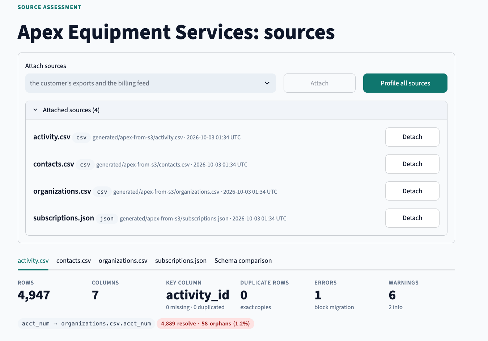
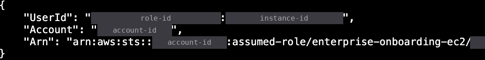
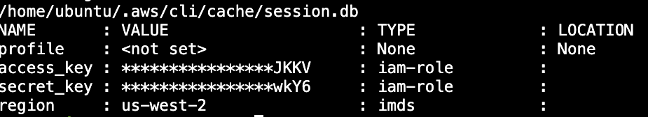
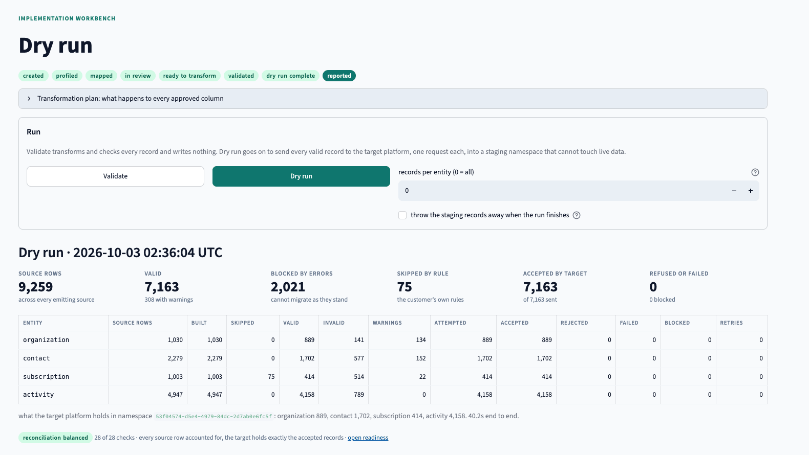
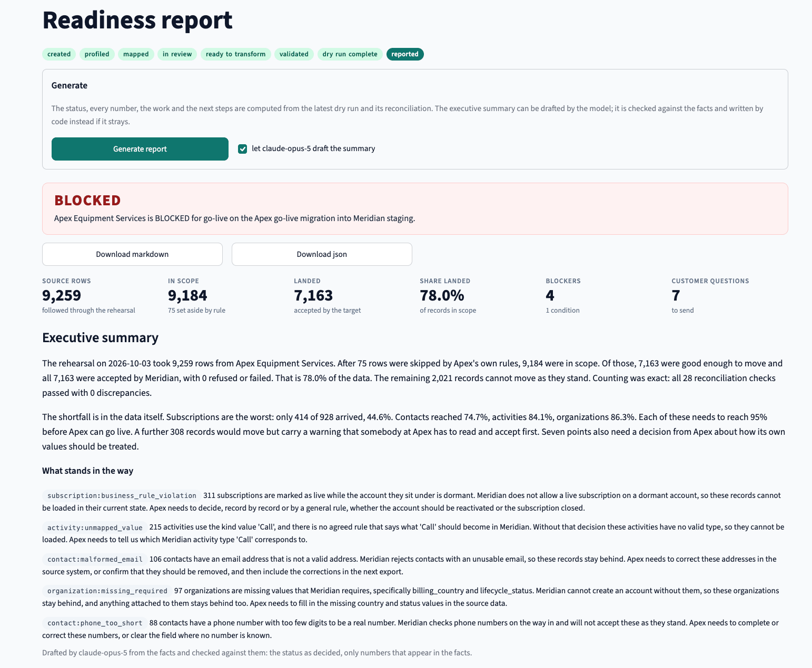
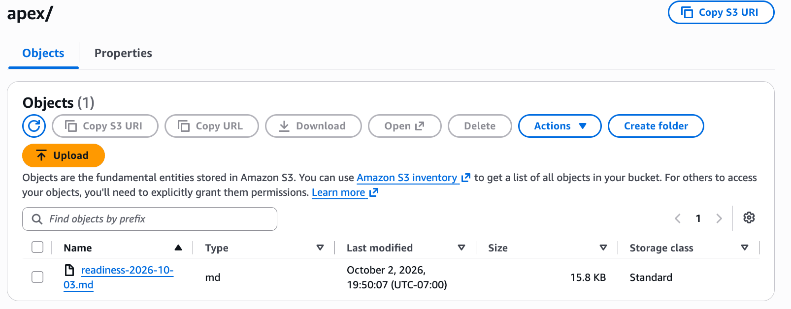
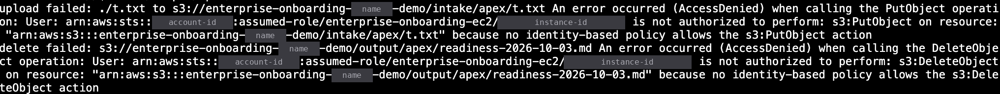
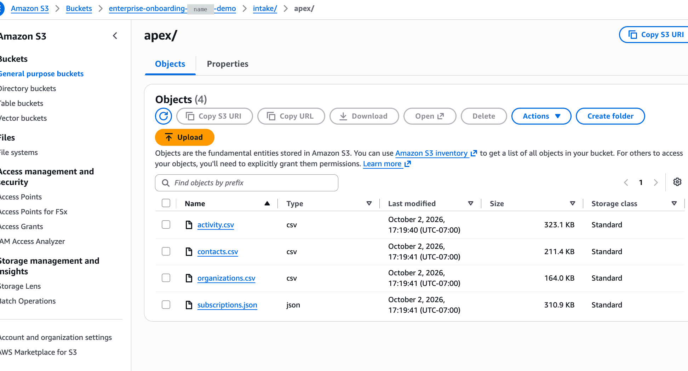

# AWS deployment

The whole stack ran on one EC2 instance in us-west-2 on 2026-10-03. The customer's files came in from a private S3 bucket, the readiness report went back out to it, and the server reached S3 through an IAM role with no access key anywhere. The run on AWS produced the same numbers as the local run, record for record.

Scope is S3 + EC2 + IAM, set up in the console. No RDS, no load balancer, no container service. PostgreSQL runs in Docker on the instance and is never reachable from outside it.

The instance is stopped between demos. How to start it again, and how to delete everything, is at the end.

## Contents

- [What the run proved](#what-the-run-proved)
- [Architecture](#architecture)
- [Resources](#resources)
- [The IAM policy, line by line](#the-iam-policy-line-by-line)
- [Deployment steps](#deployment-steps)
- [Evidence](#evidence)
- [Decisions](#decisions)
- [Found on AWS](#found-on-aws)
- [Cost](#cost)
- [Stop, start, tear down](#stop-start-tear-down)
- [What production would add](#what-production-would-add)

## What the run proved

| claim | evidence |
|---|---|
| The customer's data lands in a private S3 bucket and the server reads it from there | the four files attached in the workbench from `generated/apex-from-s3/`, copied out of `intake/apex/` by the role |
| No access key exists on the server | `aws sts get-caller-identity` answers as `assumed-role/enterprise-onboarding-ec2`; `aws configure list` shows both keys as type `iam-role`; `~/.aws` holds no credentials file |
| The cloud run gives the same answer as the local run | 9,259 rows, 7,163 accepted, 2,021 blocked, 75 skipped, 0 refused, 28 of 28 reconciliation checks, `BLOCKED` with the same coverage per entity |
| The report goes back to S3 | `upload: ./readiness.md to s3://.../output/apex/readiness-2026-10-03.md`, and the object in the console |
| The role cannot write into the customer's intake or delete anything | two `AccessDenied` errors from AWS, each ending in "because no identity-based policy allows" the action |

## Architecture

```text
operator's laptop
  browser -> localhost:8501 / localhost:8000
  ssh -N -L 8501:localhost:8501 -L 8000:localhost:8000   (the only way in to the app)
        |
        |  port 22, operator's IP only
        v
EC2  enterprise-onboarding-demo       c7i-flex.large, Ubuntu 24.04, us-west-2
  instance profile                    IAM role enterprise-onboarding-ec2
  aws cli on the host                 short-lived credentials from the instance metadata service
  docker compose                      db, api, ui; every port bound to 127.0.0.1
    db   postgres 16                  never published beyond the instance's loopback
    api  fastapi + mock target + mock billing feed
    ui   streamlit workbench
        ^                       |
        | get intake/*          | put output/*
        |                       v
S3   enterprise-onboarding-<suffix>    private, block public access on, SSE-S3
  intake/apex/    organizations.csv, contacts.csv, activity.csv, subscriptions.json
  output/apex/    readiness-2026-10-03.md

admin shell: AWS Systems Manager Session Manager in the browser, authenticated by IAM, no inbound port
```

The application itself has no AWS code. The AWS CLI on the host moves files between S3 and the app, using the role. Why, and what changes when the app talks to S3 itself, is under [Decisions](#decisions).

## Resources

| resource | setting | why |
|---|---|---|
| region | us-west-2 (Oregon) | closest to the operator |
| S3 bucket `enterprise-onboarding-<suffix>` | block all public access on; ACLs disabled; default encryption SSE-S3; versioning off | customer data is private by default and encrypted at rest with no key to manage |
| S3 layout | `intake/apex/` for what the customer sends, `output/apex/` for what the tool produces | one prefix per direction, one folder per customer, so the policy can tell them apart |
| IAM role `enterprise-onboarding-ec2` | trusted entity: EC2; managed policy `AmazonSSMManagedInstanceCore`; inline policy `s3-intake-read-output-write` | the server's only identity; the managed policy is what lets Session Manager open a shell |
| EC2 instance `enterprise-onboarding-demo` | Ubuntu Server 24.04 LTS amd64, `c7i-flex.large` (2 vCPU, 4 GiB), on demand | room for postgres, the api, the workbench and an image build at once |
| root volume | 20 GiB gp3, encrypted with the AWS-managed `aws/ebs` key, deleted with the instance | the database lives on this disk |
| instance metadata | IMDSv2 required, hop limit 2 | role credentials are only handed out to a caller holding a session token |
| security group `enterprise-onboarding-sg` | one inbound rule: SSH, port 22, from the operator's IP as a /32; outbound default | the SSH tunnel is the only path in; no app port is open |
| key pair `enterprise-onboarding-key` | ED25519, on the operator's laptop only, mode 400 | used for the tunnel; setup went through Session Manager |
| GitHub deploy key | generated on the instance, added to this repository read-only | the server can clone and pull this one repository and nothing else |

## The IAM policy, line by line

The inline policy on the role, with the bucket name replaced:

```json
{
  "Version": "2012-10-17",
  "Statement": [
    {
      "Sid": "ListOnlyTheProjectFolders",
      "Effect": "Allow",
      "Action": "s3:ListBucket",
      "Resource": "arn:aws:s3:::BUCKET",
      "Condition": { "StringLike": { "s3:prefix": ["intake/", "intake/*", "output/", "output/*"] } }
    },
    {
      "Sid": "ReadCustomerIntake",
      "Effect": "Allow",
      "Action": "s3:GetObject",
      "Resource": "arn:aws:s3:::BUCKET/intake/*"
    },
    {
      "Sid": "WriteReportsToOutput",
      "Effect": "Allow",
      "Action": "s3:PutObject",
      "Resource": "arn:aws:s3:::BUCKET/output/*"
    }
  ]
}
```

| statement | allows | why |
|---|---|---|
| `ListOnlyTheProjectFolders` | listing, inside `intake/` and `output/` only | the server has to see which files arrived; it has no reason to see anything else in the bucket |
| `ReadCustomerIntake` | reading objects under `intake/` | the customer's exports are the input |
| `WriteReportsToOutput` | writing objects under `output/` | the readiness report is the output |

What is missing is the point:

- **No write to `intake/`.** The customer's data is evidence. The tool reads it and never changes it.
- **No delete anywhere.** Not even the tool's own reports. A bug or a stolen session cannot destroy anything.
- **No read of `output/`.** The server writes reports and never needs them back.
- **No bucket settings, no other bucket, no other service.** No `s3:*`, no wildcard resource.
- **No KMS permission.** SSE-S3 encrypts with keys S3 manages, so none is needed.

`AmazonSSMManagedInstanceCore` is AWS's managed policy for Session Manager. It is broader than this demo needs (it can, for example, read any SSM parameter in the account, and there are none). A production role would carry a scoped copy.

## Deployment steps

Console steps in order. Each was done once, by hand, on 2026-10-03.

1. **Bucket.** S3, create bucket in us-west-2 with the defaults above. Create `intake/apex/` and `output/apex/`. Upload the four files from `sample_customer/data/`.
2. **Role.** IAM, create role, trusted entity AWS service, use case EC2. Attach `AmazonSSMManagedInstanceCore`. Name it `enterprise-onboarding-ec2`. Add the inline policy above as `s3-intake-read-output-write`.
3. **Instance.** EC2, launch instance: the settings in [Resources](#resources), IAM instance profile `enterprise-onboarding-ec2`, a new security group with the single SSH rule, a new ED25519 key pair. Wait for 2/2 status checks.
4. **Server setup,** in the browser shell (EC2, Connect, Session Manager):

   ```bash
   sudo -iu ubuntu
   curl -fsSL https://get.docker.com | sudo sh        # docker engine, buildx, compose plugin
   sudo usermod -aG docker ubuntu
   sudo snap install aws-cli --classic
   exit
   sudo -iu ubuntu
   docker compose version && aws --version && aws sts get-caller-identity

   # read-only deploy key for this private repository
   ssh-keygen -t ed25519 -f ~/.ssh/eo_deploy -N "" -C "enterprise-onboarding ec2 deploy key"
   cat ~/.ssh/eo_deploy.pub      # add in GitHub: Settings, Deploy keys, write access off
   printf 'Host github.com\n  IdentityFile ~/.ssh/eo_deploy\n  IdentitiesOnly yes\n' >> ~/.ssh/config
   git clone git@github.com:antofon/enterprise-onboarding.git && cd enterprise-onboarding
   cp deploy/env.template .env   # set LLM_PROVIDER=anthropic and the model key, typed on the server
   docker compose up --build -d
   docker compose ps && curl -s localhost:8000/health
   ```

5. **Data in.** On the server:

   ```bash
   BUCKET=enterprise-onboarding-<suffix>
   aws s3 ls s3://$BUCKET/intake/apex/
   aws s3 cp s3://$BUCKET/intake/apex/ ~/intake/ --recursive
   docker compose cp ~/intake/. api:/app/generated/apex-from-s3/
   ```

6. **Tunnel.** On the laptop, with the instance's current public IP:

   ```bash
   ssh -i ~/.ssh/enterprise-onboarding-key.pem -N -L 8501:localhost:8501 -L 8000:localhost:8000 ubuntu@<public-ip>
   ```

   Then `http://localhost:8501` is the workbench on EC2 and `http://localhost:8000/docs` its API.
7. **Onboarding.** In the workbench: create the project, attach the four `generated/apex-from-s3/` files, profile, suggest mappings with claude-opus-5, answer the customer questions, decide the remaining fields, dry run, generate the readiness report.
8. **Report out.** On the server:

   ```bash
   cd ~
   PID=$(curl -s localhost:8000/api/v1/projects | python3 -c "import sys,json; print(json.load(sys.stdin)[0]['id'])")
   curl -s "localhost:8000/api/v1/projects/$PID/reports/readiness?format=markdown" -o readiness.md
   aws s3 cp readiness.md s3://$BUCKET/output/apex/readiness-$(date +%F).md
   ```

9. **Least privilege, tested.** Two calls that must fail:

   ```bash
   echo test > t.txt
   aws s3 cp t.txt s3://$BUCKET/intake/apex/t.txt                      # write into intake
   aws s3 rm s3://$BUCKET/output/apex/readiness-$(date +%F).md          # delete a report
   ```

Updating the code on the server is `git pull` and `docker compose up --build -d` in `~/enterprise-onboarding`, never while a dry run is in progress. The database lives in a Docker volume and survives the rebuild.

## Evidence

Screenshots from the run. The AWS account id, the instance id, the role's internal id and the personal part of the bucket name are covered with labeled solid bars; the text blocks use placeholders for the same values.

**The workbench on EC2 attached the files that came from S3.** Every source points at `generated/apex-from-s3/`, copied there from `intake/apex/` by the role. They profiled exactly as they do locally: 4,947 activity rows, 58 orphans.



**The server is the role, and holds no key.** `aws sts get-caller-identity` on the instance:



`find ~/.aws -type f` prints one file, `~/.aws/cli/cache/session.db` (top line below). It is created by the AWS CLI itself. It stores a random session identifier the CLI attaches to its requests, not credentials. `aws configure list` shows where the keys actually come from: the role, through the instance metadata service, rotated by AWS. Even the region comes from the instance.



**The dry run on EC2 matches the local run.** On EC2 the 41 mappings were decided by hand in the workbench. Locally they came from the reviewed golden set. Every number is identical:

| | local compose (2026-10-02) | EC2 (2026-10-03) |
|---|---|---|
| source rows | 9,259 | 9,259 |
| valid, all accepted by the target | 7,163 | 7,163 |
| blocked by errors | 2,021 | 2,021 |
| skipped by the customer's rules | 75 | 75 |
| refused or failed | 0 | 0 |
| reconciliation | 28 of 28 | 28 of 28 |
| readiness | `BLOCKED`, 4 blockers, 1 condition, 7 customer questions | `BLOCKED`, 4 blockers, 1 condition, 7 customer questions |
| coverage: organizations, contacts, subscriptions, activities | 86.3%, 74.7%, 44.6%, 84.1% | 86.3%, 74.7%, 44.6%, 84.1% |
| full dry run, end to end | 65 s | 40.2 s |



`BLOCKED` is the right answer. The sample customer is messy on purpose, four entities land under the 95% floor, and the report says what Apex has to fix or decide first.



**The report went back to S3.**

```text
$ head -5 readiness.md
# Implementation readiness: Apex Equipment Services
**Status: BLOCKED**
Project: Apex go-live migration · Target: Meridian staging · Generated 2026-10-03 02:38 UTC · Report c4121f5e

$ aws s3 cp readiness.md s3://$BUCKET/output/apex/readiness-2026-10-03.md
upload: ./readiness.md to s3://enterprise-onboarding-<suffix>/output/apex/readiness-2026-10-03.md
```

The console shows it in `output/apex/`, 15.8 KB. The screenshot is from after the delete attempt below, so it is also the proof that the delete did nothing.



**What the role cannot do.** The write into `intake/` and the delete in `output/` are both refused by AWS, and the reason is the one the policy design intends: "no identity-based policy allows" the action. Nothing grants them, so no explicit deny was needed.



Afterwards `intake/apex/` still held exactly the four data files and no `t.txt`.



## Decisions

**S3 is reached from the host, not from inside the app.** The AWS CLI on the instance copies the intake files into the app's working area and copies the report out, using the role. The app has no AWS dependency and no storage switch.

- **Why:** the point of this phase was the infrastructure and the permission model, proven on a working system, without turning a week of onboarding work into an infrastructure project. The role, the policy and the refusals are the same whichever process makes the call.
- **Cost of the choice:** two manual copy steps, and the workbench cannot browse the bucket. The designed next step is a `STORAGE_BACKEND=local|s3` switch with a boto3 adapter behind the same interface as the local store, so the workbench attaches from `intake/` and writes reports to `output/` itself. boto3 finds the role's credentials the same way the CLI does, so the policy would not change.

**Ubuntu 24.04, not Amazon Linux 2023.** Docker's official install script gives the engine, buildx and the compose plugin in one command, and the Dockerfile's cache mount needs BuildKit. Amazon Linux's docker package ships without buildx or compose. Ubuntu is also what the development server runs, and Canonical's AMIs come with the Session Manager agent installed.

**c7i-flex.large, not t3.medium.** The plan was a t3.medium. The account is on the AWS Free Plan, which refused it. The c7i-flex.large is allowed on that plan, has the same 4 GiB and two newer vCPUs, and ran the full dry run in 40.2 seconds.

**No app port on the internet.** The security group opens SSH from one address and nothing else. The workbench and the API are reached through an SSH tunnel. Two layers hold this: the security group, and compose binding every published port to `127.0.0.1`, so a wrong security group edit would still not expose the app or the database. A demo URL anyone could open would need HTTPS and a login first (see [What production would add](#what-production-would-add)).

**Session Manager for the admin shell.** Setup ran in a browser shell authenticated by IAM, so the security group needs no rule for administration. SSH exists only for the tunnel.

**PostgreSQL stays in Docker.** One instance, one volume, no RDS. The database's job here is the workbench's state for a demo, and it survives stops and rebuilds. If it had to survive losing the instance, the answer is a scheduled `pg_dump` to S3 or a managed database.

**A deploy key, not a personal token.** The server holds a key that can read this one repository and cannot push. Removing it in GitHub cuts the server off.

**The model key is typed on the server.** It lives in the instance's `.env`, never in git, never in the image (`.dockerignore` keeps `.env` out), never in chat.

## Found on AWS

**A dropped click in mapping review.** The first time the operator used the workbench on EC2, picking "Ignore field" and clicking the decide button did nothing; the second click worked. The decision radio sat inside a Streamlit form, where widgets report their value only on submit, so the button still read "Approve". On submit its label changed, Streamlit treated it as a new button, and the click was lost. The same form also carried the last field's decision and note onto the next field. Fixed in `1d9866f`: the radio sits above the form, every input is keyed by the mapping, and the fix was driven in headless Chromium, 23 of 23 checks. Nothing had been recorded wrong. It was a code bug in both deployments; AWS is where a real reviewer used the screen first.

**The containers do not come back after a stop.** The compose services have no restart policy, so after starting the instance, `docker compose up -d` brings the stack back in about 20 seconds. `restart: unless-stopped` on each service would make that automatic.

## Cost

us-west-2, on-demand list prices, approximate. Confirm on the AWS pricing pages.

| item | rate | note |
|---|---|---|
| `c7i-flex.large` | about $0.085 an hour, about $2 a day | only while running |
| public IPv4 address | $0.005 an hour | only while assigned; released when the instance stops |
| 20 GiB gp3 volume | about $1.60 a month | charged while stopped too |
| S3 | under a cent a month | about 1 MB stored |
| Session Manager, S3 to EC2 transfer in-region | no charge | |

The account is on the AWS Free Plan, and this instance type is one it allows. Stopped, the demo costs the disk. Deleted, nothing.

## Stop, start, tear down

**Stop** (between demos):

```bash
cd ~/enterprise-onboarding && docker compose stop     # optional; the shutdown stops them cleanly too
```

Then EC2, Instance state, Stop, with "skip OS shutdown" unchecked so Docker and PostgreSQL shut down cleanly. Never `docker compose down -v`: `-v` deletes the database volume.

**Start:** EC2, Instance state, Start. The public IP changes, so copy the new one into the tunnel command. Then on the server:

```bash
cd ~/enterprise-onboarding && docker compose up -d
```

If the operator's home IP changed, edit the security group's SSH rule to the new "My IP".

**Tear down,** in this order:

1. Terminate the instance. The volume goes with it.
2. Delete the security group and the key pair, and the `.pem` on the laptop.
3. Empty the bucket, then delete it.
4. Delete the role. Its inline policy goes with it.
5. Remove the deploy key in GitHub, under the repository's Settings, Deploy keys.
6. Keep the account's budget alert.

## What production would add

- **The app talks to S3 itself:** the `STORAGE_BACKEND` switch and boto3 adapter described under [Decisions](#decisions).
- **Infrastructure as code:** Terraform or CDK for the bucket, role, policy, security group and instance, reviewed in a pull request instead of clicked in a console.
- **Secrets:** the model key in SSM Parameter Store or Secrets Manager, read at start through the role.
- **A reachable URL done properly:** a load balancer with a TLS certificate and SSO in front of the workbench, not an open port.
- **A tighter bucket:** a bucket policy that denies requests without TLS and anything not from the role, versioning on `intake/`, a lifecycle rule that expires old outputs, one prefix per customer with the role narrowed to it.
- **Private network path:** an S3 gateway endpoint, so S3 traffic never leaves the AWS network. It is free.
- **Operations:** the json logs shipped to CloudWatch, alarms on the instance, a scheduled `pg_dump` to S3, `restart: unless-stopped` on the services.
- **A scoped Session Manager policy** in place of `AmazonSSMManagedInstanceCore`.
